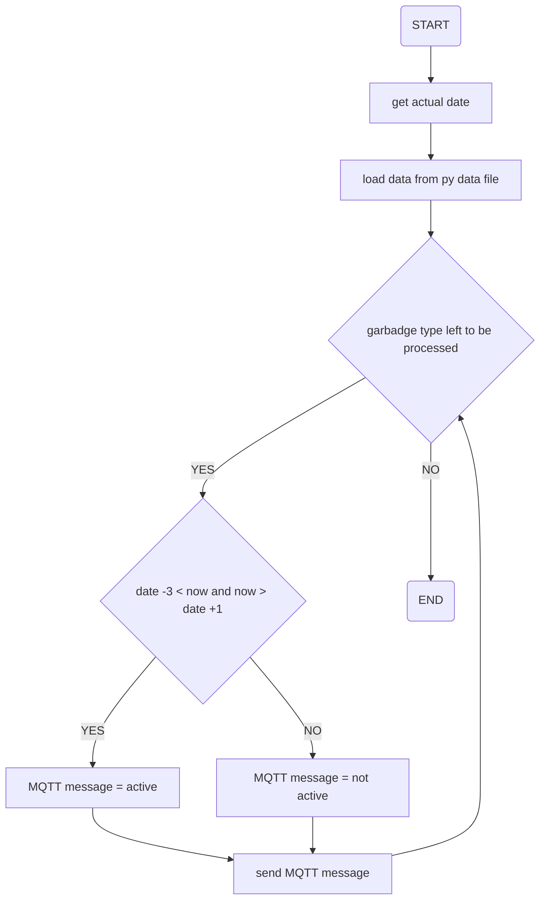

# garbage_manager
Project to manage garbage dates and populate them to MQTT broker

## Requirements and Datastructures
Once a year:
Parse the .ics calendar and generate a prettyprint file with lists for: rest, paper, plastic, organic
dates:

rest = []
paper = []
plastic = []
organic = []

Additional generate a file including the dates with comma separation for alex skill extension:

Rest
16.01.23, 30.01.23, 13.02.23, 27.02.23, 13.03.23, 27.03.23, 11.04.23, 24.04.23, 08.05.23, 22.05.23, 05.06.23, 19.06.23, 03.07.23, 17.07.23, 31.07.23, 14.08.23, 28.08.23, 11.09.23, 25.09.23, 09.10.23, 23.10.23, 06.11.23, 20.11.23, 04.12.23, 18.12.23

Paper
23.01.23, 20.02.23, 20.03.23, 17.04.23, 15.05.23, 12.06.23, 10.07.23, 07.08.23, 04.09.23, 02.10.23, 30.10.23, 27.11.23, 27.12.23

Plastic
16.01.23, 30.01.23, 13.02.23, 27.02.23, 13.03.23, 27.03.23, 11.04.23, 24.04.23, 08.05.23, 22.05.23, 05.06.23, 19.06.23, 03.07.23, 17.07.23, 31.07.23, 14.08.23, 28.08.23, 11.09.23, 25.09.23, 09.10.23, 23.10.23, 06.11.23, 20.11.23, 04.12.23, 18.12.23

Organic
09.01.23, 23.01.23, 06.02.23, 20.02.23, 06.03.23, 20.03.23, 03.04.23, 17.04.23, 02.05.23, 15.05.23, 30.05.23, 12.06.23, 26.06.23, 10.07.23, 24.07.23, 07.08.23, 21.08.23, 04.09.23, 18.09.23, 02.10.23, 16.10.23, 30.10.23, 13.11.23, 27.11.23, 11.12.23, 27.12.23

The program:
- shall be executed each hour
- shall use a prettyprint file with four separate lists
- base on the actual date, shall check the next garbage collections
- if now is in a range of (garbadge date -3) > now and now < (garbage date +1), garbadge date mqtt message = "Active", else "Not Active"

## Design and program flow

Programm läuft jede Stunde.

## Setup Development Environment

## Deploy and Execute of the Program

### Command Line
```
python garbmgr.py
```

### Using the Docker container
build the image:
```
docker build --tag garbage_manager .
```
build the image on a MacBook Air M2 supporting Synology platform:
```
docker build --tag garbage_manager . --platform linux/amd64
```
run the image:
```
docker run -it --name garbage_manager garbage_manager
```
save and deploy the image:
```
docker save -o garbage_manager.tar garbage_manager

```